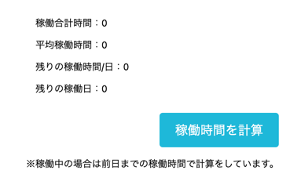

# Jobcan Chrome Extension

このChrome拡張機能は、ジョブカン勤怠システムでの稼働時間を計算し、ポップアップで表示します。

## 機能

- 稼働合計時間の表示
- 平均稼働時間の表示
- 残りの稼働時間/日の表示
- 残りの稼働日の表示

## 使い方

1. このリポジトリをクローンするか、ZIPファイルとしてダウンロードしてください。
2. Google Chromeブラウザで `chrome://extensions/` を開きます。
3. 右上の「デベロッパーモード」を有効にします。
4. 「パッケージされていない拡張機能を読み込む」をクリックし、ダウンロードしたフォルダのdist配下を選択します。
5. Chromeのツールバーにアイコンが追加されます。アイコンをクリックして拡張機能を起動します。
6. ポップアップで「稼働時間を計算」ボタンをクリックします。



## Prerequisites

* [node + npm](https://nodejs.org/) (Current Version)

## Includes the following

* TypeScript
* Webpack
* React

## Project Structure

* src/typescript: TypeScript source files
* src/assets: static files
* dist: Chrome Extension directory
* dist/js: Generated JavaScript files

## Setup

```
npm install
```


## Build

```
npm run build
```

## Build in watch mode

### terminal

```
npm run watch
```

### Visual Studio Code

Run watch mode.

type `Ctrl + Shift + B`

## Load extension to chrome

Load `dist` directory

## Reference
https://github.com/chibat/chrome-extension-typescript-starter


